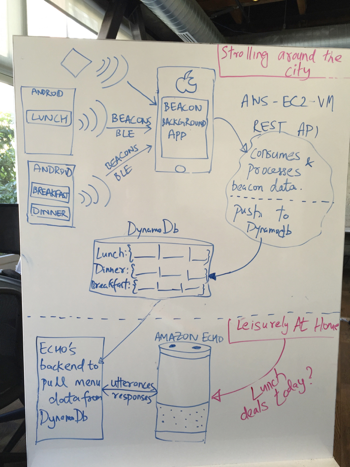

#Beacon-Box

##Motivation
A win-win eco-system between customers and bars, restaurants, etc.

Say on the streets of Hollywood, we are strolling around during the day. We have Beacons placed in bars or restaurants. The iPhone App can 
capture the deals or information sent out the Beacons (received via, BLE - Bluetooth Low Energy) - [*BeaconCollector - iOS*]
The applications send the data to the REST based service. - [*BeaconCloud*]. This piece also processes the data and stores it in a DynamoDB
After going back home, we can ask Alexa - [*BeaconAlexa*] to read out the deals we collected and use it for something during the week or weekend.

##Architecture
Completely hosted on Amazon AWS.



###Components
####BeaconCollector-IOS
The iOS app that captures the beacons sent out by Estimote beacons.

To install:
Open xcode and run the application on your phone. the UI is really only meant as an FYI. It captures the data and sends it to the BeaconCloud
project.

#####BeaconCloud
Springboot based REST endpoint. It accepts the data sent by the iPhone over a post request. The data is processed and pushed to a Dynamodb.

####BeaconAlexa
Alexa's backend (hosted on AWS) is a lambda function. It hits the DynamoDb, fetches the information sent by the Beacons and read it out when asked.

###How to setup the environment

####Setup DynamoDB
On AWS, setup up a DynamoDb named **EstimoteBeacon**
The PrimaryKey is _BeaconCategory_ and the value is _BeaconValue_

####Start the cloud service - BeaconCloud
Create an EC2 instance in AmazonAWS
Instructions to run:

```
➜  Beacon-Box git:(master) ✗ cd BeaconCloud 
➜  BeaconCloud git:(master) ✗ cd beacon-main 
➜  beacon-main git:(master) ✗ mvn clean install
➜  beacon-main git:(master) ✗ cd target 
➜  target git:(master) ✗ scp -i ~/.aws/npcomplete.pem beacon-main-1.0-SNAPSHOT.jar ubuntu@<IP>: 
```
On Amazon EC2
``` 
$  ✗ java -jar beacon-main-1.0-SNAPSHOT.jar
```

####Start the iOS Application - BeaconCollector-iOS
Change the IP in the code to point to where the cloud rest service (IP of the EC2 instance) is running. Run the applicatino from XCODE to iPhone
 

####BeaconAlexa
This is a skill we have already hosted on our amaazon alexa. We plan to release this application after productionize the eco-systen.
